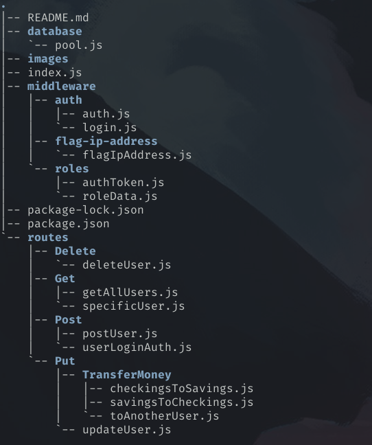

# Dhruv-Banking

---

[Getting Started](#getting-started) | [User Modal](#user-modal) | [Endpoints](#end-points) | [Tokens](#tokens) | [Flagging Ip's](#flaging-ip) | [Roles](#roles) | [License](#license)

## Getting Started

First to get started, you'd clone the repo:

```shell
$ git clone https://github.com/Dhruv-Banking/Dhruv-Banking.git
```

then cd in the directory, and run the command below:

```shell
$ cd {directory name}
> npm init -y
> npm i --save express bcrypt cors dotenv express-rate-limit jsonwebtoken pg uuid
```

then also save these as dev dependencies (for ease of use)

```shell
$ npm i --save-dev nodemon morgan
```

then in the directory, create a `.env` file, and add these lines:

```
CONNECTIONSTRING={your connection string}
ACCESS_TOKEN_SECRET={your access token}
```

- For `CONNECTIONSTRING` add the connection to your own postgresql database
- For `ACCESS_TOKEN_SECRET` I used:

```shell
$ node
> require('crypto').randomBytes(64).toString('hex')
```

Your directory should look something like this, but there should be a `node_modules` directory:



---

## User Modal

- There are 3 models for users, but they all follow the same base user:

```json
{
  "uuid": "e2aad8a3-9968-4e2a-a0a3-a27f0b0519ba",
  "username": "Rick__Astley",
  "firstname": "Rick",
  "lastname": "Astley",
  "email": "rickastleyissocool@rick.astley",
  "password": "$2b$12$5z39LzhwvGI7jKfzTF7okOOR12q96CSRsavjgsGAj8hI4bquHIuye",
  "savings": 0,
  "checkings": 0,
  "role": "GOD"
}
```

as you can see, the password is hashed in-case a hacker get's access to the database.

---

## End points

> NOTE: localhost:3000 is a place holder untill i host it on google

Note: All the endpoints require a token, so see [Tokens]() for more info on getting a token

For all endpoints, if the token is null, or you don't provide one -- you'll get this error:

```json
{
  "result": "Forbidden"
}
```

#### List of all endpoints (Currently):

- localhost:3000/
- localhost:3000/getAllUsers
- localhost:3000/specificUser?username={username}
- localhost:3000/postUser
- localhost:3000/authUserLogin
- localhost:3000/deleteUser
- localhost:3000/updateUser?username={username}
- localhost:3000/checkingsToSavings?username={username}
- localhost:3000/savingsToCheckings?username={username}
- localhost:3000/transferToAnotherUser?userFrom={username}

### Localhost:3000/-GET

> This endpoint it the base url, to make sure everything works well.

This endpoint requires a token, and the token can have the role of anytype -- since it dosen't hold any data.

See [Tokens]() for more info on getting a token

If everything works fine, you should get the result:

```json
{
  "detail": "Please pick an endpoint, refer to the docs"
}
```

or if your token isn't valid, you will get this error:

```json
{
  "result": "Forbidden"
}
```

### Localhost:3000/getAllUsers-GET

When making this request, you need to provide a token, with the role of "GOD", or "ADMIN"

When you provide a valid token, the result should be as followed, a list full of JSON objects:

```json
[
  {
    "uuid": "e2aad8a3-9968-4e2a-a0a3-a27f0b0519ba",
    "username": "Rick__Astley",
    "firstname": "Rick",
    "lastname": "Astley",
    "email": "rickastleyissocool@rick.astley",
    "password": "$2b$12$5z39LzhwvGI7jKfzTF7okOOR12q96CSRsavjgsGAj8hI4bquHIuye",
    "savings": 0,
    "checkings": 0,
    "role": "GOD"
  }
]
```

if the token provided has the role of "BASIC", then you'll get this error:

```json
{
  "detail": "You don't have the right role"
}
```

### Localhost:3000/specificUser?username={username}-GET

This is the endpoint to get the data from the user, you can have anyrole to access this endpoint. But you need a token.

For a 200 resposne you should get:

---

## Tokens

This is the endpoint to get a token for the API. You need a token to get access any endpoint for the API

### How to get a token:

You need to make a **POST** request to `http://localhost:3000/users/login`, and in the request body you need to provide your login details.

```json
{
  "name": "Rick__Astley",
  "password": "ILoveRickAstleyNoHomo"
}
```

### How tokens work:

the token gets the role from the table "users", and that's the privldge you get.

```js
const user = {
  name: sqlRes.rows[0].username,
  password: sqlRes.rows[0].password,
  role: sqlRes.rows[0].role,
};
```

and thats the data that the token has. Then we use a middleware to decrypt the token, and then we get the role from that token.

example of the middle ware:

```js
// JSW as an import
const jwt = require("jsonwebtoken");
const roleData = require("./roleData"); // Importing the secret role data

function returnRole(token) {
  let decoded = jwt.verify(token, process.env.ACCESS_TOKEN_SECRET);
  return decoded.role;
}

// ------------------- GET ------------------- //
function authRoleGetAllUsers(req, res, next) {
  var authHeader = req.headers["authorization"];
  const token = authHeader && authHeader.split(" ")[1]; // Spliting becase it goes: "Bearer [space] TOKEN"
  if (token === null) return res.sendStatus(401); // If the token sent is null, then we know there is no token to be verified

  // Saving the returned role to the var role
  let role = returnRole(token);

  // Veryifying the role to make sure
  if (role === roleData.admin || role === roleData.god) {
    next();
  } else {
    res.status(401);
    return res.send({ detail: "You don't have the right role" });
  }
}
```

---

## Flaging Ip's
